# Building a Minecraft Server :computer:
The project includes 2 types of hosting a minecraft server,
* One is creating a systemd service to launch the Minecraft server automatically 
* On the other side easier method is to launch it manually.
## Table of Contents:book:
- [Building a Minecraft Server :computer:](#building-a-minecraft-server-computer)
  - [Table of Contents:book:](#table-of-contentsbook)
  - [Hardware Requirements:pen:](#hardware-requirementspen)
  - [Software Requirements](#software-requirements)
    - [Installing Java:coffee:](#installing-javacoffee)
    - [Creating a minecraft user](#creating-a-minecraft-user)
    - [Switching to the created user :back:](#switching-to-the-created-user-back)
    - [Installing minecraft on Ubuntu :office:](#installing-minecraft-on-ubuntu-office)
    - [Downloading and Compiling MCRCON](#downloading-and-compiling-mcrcon)
    - [Downloading the Minecraft Server](#downloading-the-minecraft-server)
    - [Configuring the Minecraft Server](#configuring-the-minecraft-server)
    - [Creating a systemd Unit File](#creating-a-systemd-unit-file)
    - [Starting the Minecraft Server](#starting-the-minecraft-server)
    - [Setting up a firewall for the minecraft server.](#setting-up-a-firewall-for-the-minecraft-server)
    - [Adjusting firewall for to access outside local network](#adjusting-firewall-for-to-access-outside-local-network)
    - [PLAYING MINECRAFT SERVER LOCALLY](#playing-minecraft-server-locally)
    - [Works Cited](#works-cited)

## Hardware Requirements:pen:
* DDoS Protection
* 2.8Ghz+ CPU
* 6+ GB RAM (if running the server and game on your own computer)
* 1+ GB RAM (if using a hosting company for your server)
* Automatic backup capabilities
* Very fast connection with proper routing for player connections
## Software Requirements
* A Java runtime (JRE), version 8 or higher. JDK contains JRE, so it will work too.
* RCON is a protocol that allows you to connect to the Minecraft servers and execute commands. mcron is RCON client built in C.

### Installing Java:coffee:
1.First the repository needs to be updated to have the latest JDK(Java Development Kit (Open JDK), an open-source implementation of the Java platform.).
* > <mark> **sudo apt update** </mark> which will result this. 
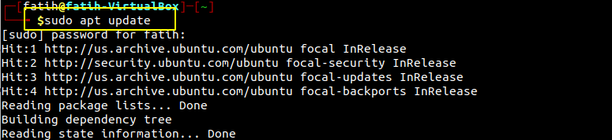

2.Then to install JDK the following command is required .
* > <mark> **sudo apt install default-jdk** </mark> 
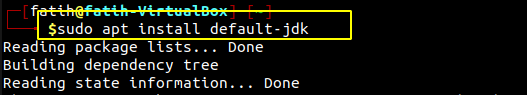
* Say Yes to the following question. 

3.Verifying that the java is successfully installed on Ubuntu, we run the following command
*  > <mark> **java -version** </mark> 
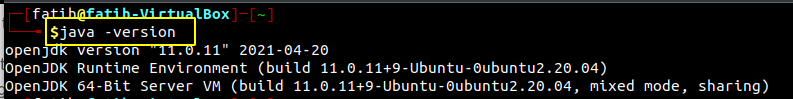

### Creating a minecraft user 
* For security purposes, Minecraft should not be run under the root user. We will create a new system user and group with home directory /opt/minecraft that will run the Minecraft server:
* **useradd** command is a low-level utility that is used for adding/creating user accounts in Linux. 
  
* **useradd [OPTIONS] USERNAME** is the usage
* > <mark> **sudo useradd -r -m -U -d /opt/minecraft -s /bin/bash minecraft** </mark> 
* 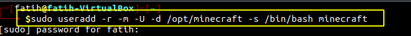
* This command will create a home directory elsewhere using -d  
* With -u (--uid) option to create a user with a specific UID and also by default if no UID is given
* With  -r option to create a system user account and 
* With -m option to create the user home directory as /home/username. 
* With -s (--shell) option allows you to specify the new user’s login shell.

### Switching to the created user :back:
* Run the following command to switch to the **minecraft** user.
* > <mark>sudo -su minecraft</mark>
* su means = switch user.
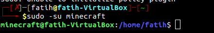

### Installing minecraft on Ubuntu :office:
* We create 3 directories using brace expansion.
* > <mark>**mkdir -p ~/{backups,tools,server**}</mark>
* The backups directory will store your server backup.
*  The tools directory will have the mcrcon client and backup script.
*   The server directory will contain the actual Minecraft server and its data.

### Downloading and Compiling MCRCON
* RCON is a protocol that allows you to connect to the Minecraft servers and execute commands. mcrcon is RCON client built in C.
* We will download the source code and build the mcrcon binary.
* > <mark>cd ~/tools && git clone https://github.com/Tiiffi/mcrcon.git</mark>
* 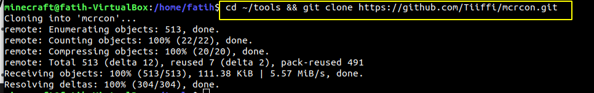
* This command will navigate to the tools directory we created before and will clone the github repo needed. For the repository click [here](https://github.com/Tiiffi/mcrcon.git)
* > Now we need to navigate to the /tools/mcrcon directory using <mark>**cd ~/tools/mcrcon**</mark>
* GCC is a short of GNU Compiler Collection, a C compiler for Linux.
* Gcc is used like this:
* **gcc [options] [source files] [object files] [-o output file]**
* We will start the mcrcon process by the following command.
* > <mark>**gcc -std=gnu11 -pedantic -Wall -Wextra -O2 -s -o mcrcon mcrcon.c**</mark>
* -Wall enables all warning messages,
* -o will link to output file,
* -s will Remove all symbol table and relocation information from the executable.
* -Wextra will  This enables some extra warning flags that are not enabled by 
* -O2 will optimize more compared to -O1 option, 
* language standard is = gnu11 which means GNU dialect of ISO C11.  This is the default for C code. 
* -pedantic warns about C++ style // comments.

**To test it you can run it by the following command.**:+1:
* > **./mcrcon -h**
* You should have a similar screen to this
* 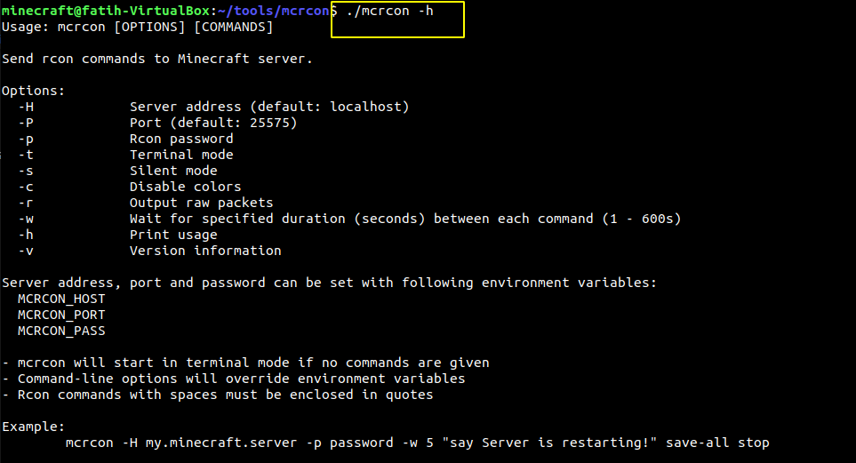

### Downloading the Minecraft Server
To download and save the Minecraft JAR(Java archive file) we use **wget** and the following command
* > <mark> cd ~/server | wget  https://launcher.mojang.com/v1/objects/1b557e7b033b583cd9f66746b7a9ab1ec1673ced/server.jar</mark> 
* It should look like this
* 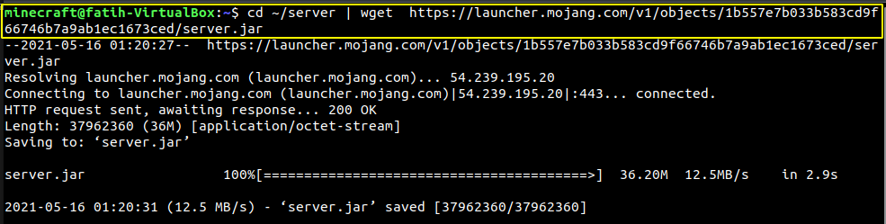
* ! Make sure to download the latest Launcher and the link can be found [here](https://www.minecraft.net/en-us/download/server)!

### Configuring the Minecraft Server
  
* We will navigate to the **server directory**(cd ~/server) to start our minecraft server using the following command that mojang provides us on their download website.
* > <mark>**java -Xmx1024M -Xms1024M -jar server.jar nogui**</mark>
* java -jar command lets us open JAR files and the -Xmx is maximum is the maximum heap size in this case its 1024 and 1024. 
* After running that command you should receive an error like this saying that you need to accept EULA terms.
* 
* To accept the eula terms you can use any text editor to change value of **eula=false** >>> **eula=true**
* vim eula.txt 
* 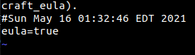
* Now we will edit our server properties to enable rcon protocol and set a rcon password with your favorite text editor.
* > <mark>**vim ~/server/server.properties**</mark>
* 

### Creating a systemd Unit File
* In systemd, a unit refers to any resource that the system knows how to operate on and manage. This is the primary object that the systemd tools know how to deal with. These resources are defined using configuration files called **unit** files.
* Units in some ways can be said to similar to services or jobs in other init systems. However, a unit has a much broader definition, as these can be used to abstract services, network resources, devices, filesystem mounts, and isolated resource pools.
* We will switch back to our main user to create a systemd unit file.
*  we use the command <mark>**exit**</mark> to switch to our sudo user and we will create a file named minecraft.service in our systemd files location which is /etc/systemd/system/
*  > <mark>**sudo vim /etc/systemd/system/minecraft.service**</mark>
* Then copy and paste the configuration which includes the required configs with explanations.
* > 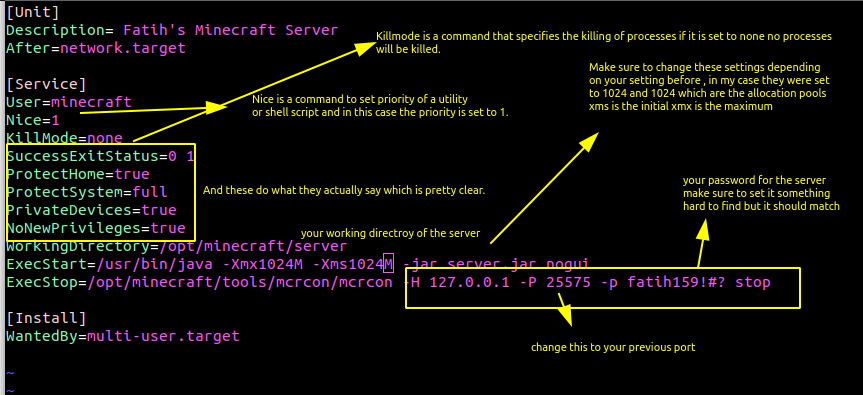
* After we save that file and close it, we reload the systemd manager for our configs to apply , we run the following command. **systemctl is the tool for the usage of systemd system and services**. 
* > <mark>**sudo systemctl daemon-reload**</mark>

### Starting the Minecraft Server
As mentioned above , we will use systemctl command to start our systemd service, in this case our server by using the following command.
* > <mark>**sudo systemctl start minecraft**</mark>
* 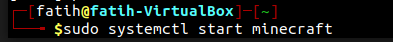
* To check the status of our server we use another option with the sytemctl command which is 
* > <mark>**sudo systemctl status minecraft**</mark>
* 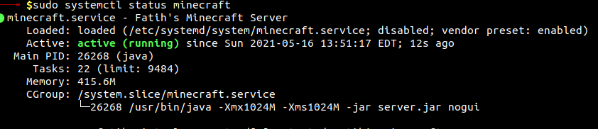
* And to adjust our minecraft server to boot with our system we use the same command with another option once again, in this case it is.
* > <mark>**sudo systemctl enable minecraft**</mark> which will create symlink.

### Setting up a firewall for the minecraft server.
* Enabling a firewall makes it easier to control incoming and outgoing traffic on your server. There are many firewall applications you can use on Linux, including firewall-cmd and Uncomplicated Firewall (UFW). To install it run the following command.
* > <mark>**sudo apt install ufw**</mark> 
* and by default it will be inactive, to enable it use > <mark>**sudo ufw enable**</mark>
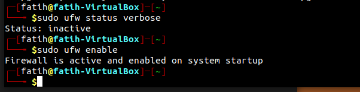

### Adjusting firewall for to access outside local network
* We will adjust To allow traffic on the default Minecraft port 25565 type the following command
* <mark>**sudo ufw allow 25565/tcp**</mark>

### PLAYING MINECRAFT SERVER LOCALLY
* We run the following command to run the server MANUALLY
* > <mark>java -Xmx1024M -Xms1024M -jar server.jar nogui</mark>
* 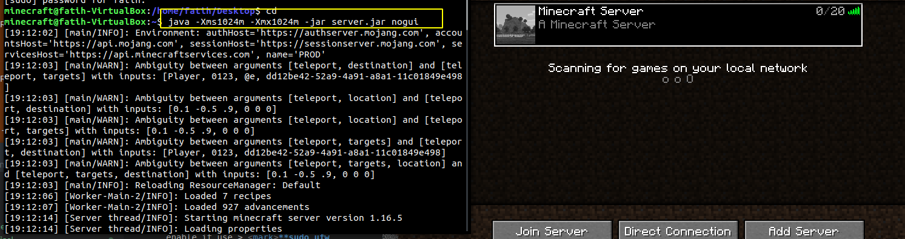

### Works Cited
1.Linuxize. “How to Install Minecraft Server on Ubuntu 18.04.” Linuxize, Linuxize, 20 May 2019, 
* linuxize.com/post/how-to-install-minecraft-server-on-ubuntu-18-04/#adjusting-firewall. 

2.“Tutorials/Setting up a Server.” Minecraft Wiki, 
* minecraft.fandom.com/wiki/Tutorials/Setting_up_a_server#Debian.2C_Ubuntu.2C_Raspbian. 

3.“Set Up Dedicated Minecraft Server on Linux {9-Step Process}.” Knowledge Base by PhoenixNAP, 22 Apr. 2021, 
* phoenixnap.com/kb/minecraft-dedicated-server.

4.“How To Make a Minecraft Server - The Complete Guide.” Apex Hosting, 7 May 2021,
* apexminecrafthosting.com/how-to-make-a-minecraft-server/. 

5.Canonical. Ubuntu Manpage: Gcc - GNU Project C and C++ Compiler, 
* manpages.ubuntu.com/manpages/bionic/en/man1/gcc.1.html. 

6.Tiiffi. “Tiiffi/Mcrcon.” GitHub,
* github.com/Tiiffi/mcrcon. 

7.“Server.properties.” Minecraft Wiki,
* minecraft.fandom.com/wiki/Server.properties. 

8.Sahana Sreeram&nbsp;Feed80up5 comments, et al. “6 Open Source Tools and Tips to Securing a Linux Server for Beginners.
* Opensource.com, opensource.com/article/21/4/securing-linux-servers. 