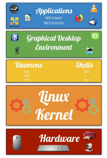
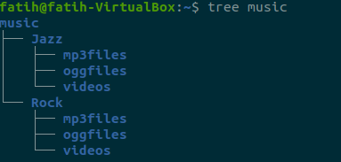
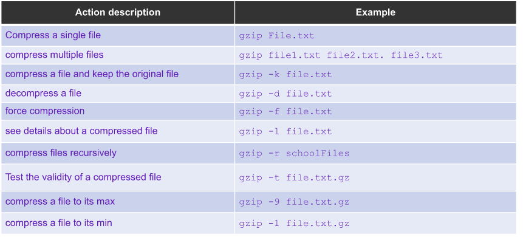
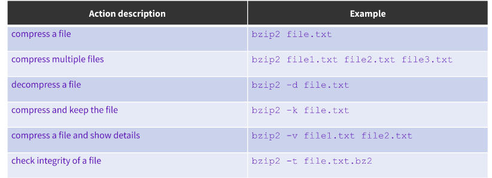
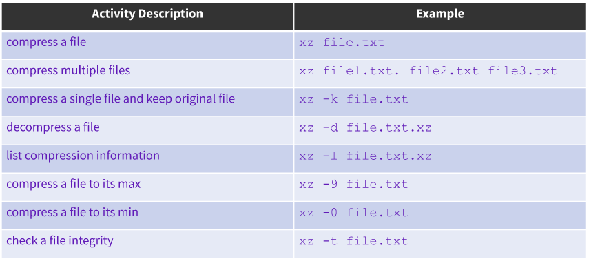
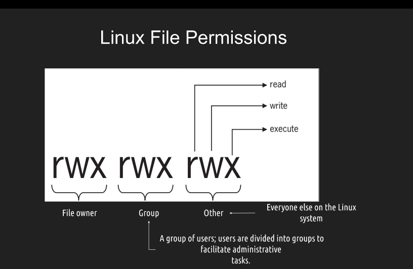
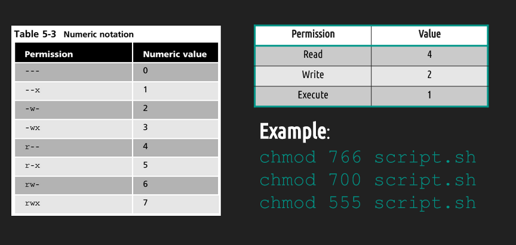

# FINAL NOTES
# TABLE OF CONTENT

<!-- TOC -->
- [FINAL NOTES](#final-notes)
- [TABLE OF CONTENT](#table-of-content)
- [Notes Lecture 1 What is Linux](#notes-lecture-1-what-is-linux)
  - [Why Do you need to learn linux?](#why-do-you-need-to-learn-linux)
  - [Linux Distributions](#linux-distributions)
  - [Linux Architecture](#linux-architecture)
  - [Software licensing agreement](#software-licensing-agreement)
  - [Advantages/Disadvantages of Open Source software](#advantagesdisadvantages-of-open-source-software)
  - [What is Ubuntu?](#what-is-ubuntu)
- [NOTES LECTURE 2 INSTALLING UBUNTU](#notes-lecture-2-installing-ubuntu)
  - [WHAT IS VIRTUALIZATION?](#what-is-virtualization)
    - [There are 2 general types of Virtualization ;](#there-are-2-general-types-of-virtualization-)
  - [INSTALLING UBUNTU IN A VIRTUAL MACHINE](#installing-ubuntu-in-a-virtual-machine)
    - [Steps to install and configure your Hypervisor with Ubuntu](#steps-to-install-and-configure-your-hypervisor-with-ubuntu)
    - [Virtualbox Extension Pack](#virtualbox-extension-pack)
- [Notes 3 | Learning The Bash Shell](#notes-3--learning-the-bash-shell)
  - [Exploring Desktop Environments](#exploring-desktop-environments)
    - [Example of a GNOME DE](#example-of-a-gnome-de)
    - [Example of KDE](#example-of-kde)
  - [What is a Shell? :boom:](#what-is-a-shell-boom)
    - [What is a Terminal? :dart:](#what-is-a-terminal-dart)
  - [Managing Software](#managing-software)
  - [The Linux Filesystem](#the-linux-filesystem)
- [NOTES 4 | MANAGING FILES AND DIRECTORIES](#notes-4--managing-files-and-directories)
  - [Creating Directories](#creating-directories)
  - [Creating Files](#creating-files)
  - [Deleting Files and Directories](#deleting-files-and-directories)
  - [Moving files and directories](#moving-files-and-directories)
  - [Copying Files and Directories](#copying-files-and-directories)
  - [Working with links](#working-with-links)
    - [HARD LINKS AND SOFT LINKS](#hard-links-and-soft-links)
  - [GETTING HELP](#getting-help)
  - [WILDCARDS/ FILE GLOBBING](#wildcards-file-globbing)
    - [THE * WILDCARD](#the--wildcard)
    - [THE ? WILDCARD](#the--wildcard-1)
    - [THE [] WILDCARD](#the--wildcard-2)
  - [USING BRACE EXPANSION](#using-brace-expansion)
- [NOTES 5 | Handling TEXT FILES](#notes-5--handling-text-files)
  - [CAT](#cat)
  - [TAC](#tac)
  - [MORE](#more)
  - [LESS](#less)
  - [HEAD](#head)
  - [DIFF](#diff)
  - [TAIL](#tail)
  - [CUT](#cut)
  - [PASTE](#paste)
  - [SORT](#sort)
  - [WC](#wc)
  - [TR](#tr)
  - [GREP](#grep)
  - [Rev](#rev)
  - [I/O Redirection](#io-redirection)
  - [The pipe |](#the-pipe-)
  - [Alias](#alias)
- [Notes Lecture 06 | Managing Data and File permissions](#notes-lecture-06--managing-data-and-file-permissions)
  - [Text Editors](#text-editors)
  - [Managing Data](#managing-data)
  - [Linux File Permissions | File Ownership.](#linux-file-permissions--file-ownership)

<!-- /TOC -->

# Notes Lecture 1 What is Linux

## Why Do you need to learn linux?
* Linux runs in a lot of devices. Example: laptops, desktops, servers, smartphones, IoT devices, etc
* Linux powers the cloud
* Linux is used by a lot of companies even Microsoft
##What is Linux?
* Linux is a kernel. A kernel is the core of any operating system.
* An operating system that uses the Linux kernel is called a Linux Distribution. Example: Ubuntu and Android.
* Linux is multitasking, multi-user, and multipurpose OS.
* Linux is a modular operating system.
##Linux books I can use:
* Linux Administration A Beginner's Guide 8th Edition by Wale Soyinka
* CompTia Linux+ Study Guide by Christine Bresnahan
* The Linux Command Line by William Shotts
  
## Linux Distributions

* There are a large number of Linux distributions.
* There are two main Linux Distributions:
  * Debian
  * Redhat
* There are also other independent distributions:
  * Slackware
  * Arch
  * Gentoo 
## Linux Architecture

* Linux is modular which means that users can remove and add/remove whatever they need or don't need.
  * **Kernel** = the core of the operating system. Manages the hardware.
  * **Daemons** = background programs that run independent of the user.
  * **Shells** = the interface that accepts user input and translates it so that the kernel can use it.
  * **Graphical Desktop Environment** = a collection of software that makes the graphical interface.
* In Linux everything is a file.
* Type of files:
  * Device files
  * Directory files
  * Binary files
  * Regular files
## Software licensing agreement
* A license agreement outlines the rights a user has to a given software
* Types of licensing agreement:

OPEN SOURCE|CLOSED SOURCE|FREE SOFTWARE|
-----------|-------------|-------------|
Software can be distributed for free or a fee **The source code must be distributed with the software**.|Software can be distributed for free or a fee. **The end user has limited access to the software and the source code is not available** .|Software can be distributed for free or a fee. The user has total control of the software and the source code.The software must comply with the 4 freedoms.

**The 4 freedoms**
* Freedom 0: the user can run the program as you wish, for any purpose .
* Freedom 1: the user can study how the program works, and change it.
* Freedom 2: the user can redistribute copies.
* Freedom 3: the user can distribute copies of your modified versions.

**Learn more:** https://www.gnu.org/philosophy/free-sw.en.html
## Advantages/Disadvantages of Open Source software

## What is Ubuntu?
Ubuntu is a Linux distribution, free and available for community and professionals. Ubuntu aims to achieve
these
The software should be free and configured as the user wants
Is available despite any disability someone might have
Is suitable both for desktop and server use
Ubuntu was created to be a user friendly version of Debian which is know to be the Grandfather of all linux
distributions.

Examples of Linux distributions based on Ubuntu and Debian :
Ubuntu > Linux Lite, Linux Mint, Peppermint 
Debian >Kali Linux ,Parrot OS, Steam OS

# NOTES LECTURE 2 INSTALLING UBUNTU
## WHAT IS VIRTUALIZATION?
**Virtualization** is the replication of hardware to simulate a virtual machine inside a physical machine. It is basically using computer inside a computer as long as the hardware specifications are good enough to handle.

### There are 2 general types of Virtualization ;
* Server-side Virtualization:computer:
* Client-Side virtualization:man:
**Main difference between them is where the virtualization is taking place**:+1:

Client-side Virtualization | Server-side virtualization
---|---|
|||

For Client-side Virtualization the computer needs a ***hypervisor***.
A ***hypervisor*** is a software that allows the management of virtual machines.
There are 2 types of hypervisors.
* Type 1 Hypervisor(Runs on the hardware)
  Example : Citrix XenServer
* Type 2 Hypervisor(Runs on a host operating system)  
  Example : Oracle Virtualbox
## INSTALLING UBUNTU IN A VIRTUAL MACHINE
For installing ubuntu we need a Hypervisor(software that allows the management of virtual machines).
To install ubuntu we will install **Oracle Virtualbox** which is an example of Type 2 Hypervisor. 
The link for the Hypervisor can be found [here](https://www.virtualbox.org/wiki/Downloads) or if that does not work here https://www.virtualbox.org/wiki/Downloads
**(*It has a simple installation process just keep clicking next until it is finished and should not take more than 2-3 minutes.*)**

### Steps to install and configure your Hypervisor with Ubuntu
* Click the new button to open a dialog and name your virtual machine and if you are not sure about what you are doing use **Ubuntu** which will automatically choose the type and the version for you.

Secondly you need to adjust your **memory(RAM)** to be allocated for this virtual machine.If you are not sure leave it to recommended for now and change it later.

After selecting the ram amount , Accept the default create a virtual hard disk drive option and click **"Create"**.

Continue to accept the default 'VDI' drive file type and click 'Next' button.

After this step you can either choose Dynamically allocated or fixed size but fixed size will give you a **better performance.**

This step is to choose the memory which depends totally on your storage and preference but allocating less than **8GB** may cause system errors.:-1:

Once the virtual machine has been created we need to install ubuntu into the virtual machine. In order to install Ubuntu the ISO file is required to integrate Ubuntu into the hypervisor. 
The link to the iso files can be found **[here](https://ubuntu.com/download/desktop)**

After downloading the iso file , Select your new virtual machine and click 'Settings' button. Click on 'Storage' category and then 'Empty' under Controller:IDE. Click "CD/DVD" icon on right hand side and select the ubuntu ISO file to mount. It should look similar to this.

Back to Oracle VM VirtualBox Manager, click on the new Ubuntu virtual machine and hit 'Start' button. Now you shall see a 'Welcome' screen. Ubuntu will ask a few simple questions such as;
* Click 'Install Ubuntu' button.
* Click 'Continue' button
* Make sure 'Erase disk and install Ubuntu' option is selected and click 'Install Now' button.
* Ubuntu will ask you a few more questions. If the default is good, click 'Continue' button.

* **After reaching the Who are you? question make sure to note the username and password that you will create and choose a secure password with characters and numbers included.**

After the installation is completed the system will prompt for a restart.After the restart Ubuntu is ready to use.:+1:
### Virtualbox Extension Pack
Even though it is **not necessary** Virtualbox Extension Pack can be useful in many ways.

VirtualBox Extension Pack is a binary package intended to extend the functionality of VirtualBox. The Extension pack adds many functionalities to the hypervisor  such as USB 2.0 and USB 3.0 devices, VirtualBox RDP, disk encryption, NVMe and PXE boot for Intel cards.

 The link for that can be found [here](https://www.virtualbox.org/wiki/Downloads)

# Notes 3 | Learning The Bash Shell
## Exploring Desktop Environments
During the 1980s and 1990s, the introduction of the Apple Macintosh and of Microsoft Windows on PCs saw the **command line interface** as the primary user interface replaced by the **Graphical User Interface**(The desktop environment is a GUI which is an implementation of the desktop metaphor)

There are many Graphical Desktops you can choose from.
**Most popular Graphical Desktops are**
* GNOME
* KDE
Windows and macOS users are limited to single Graphical User Interface and Desktop Environment while a Linux user has almost unlimited number of GUI choices.

To discuss the most common Desktop Environments
### Example of a GNOME DE

### Example of KDE 

## What is a Shell? :boom:
* CLI : A command-line interface is where the user commands to interact with the computer.
* The shell is a program that takes commands from the keyboard and gives them to the operating system to process and perform. 
* On most Linux systems a program called **bash**:+1: acts as the shell program.

### What is a Terminal? :dart:
It is a program which brings a new window in order to interact wih th shell and it is called  **terminal emulator**.
The terminal requires practice and is easy to learn but hard to master.
*Terminal Picture*

## Managing Software
Basic Terminology about using software in Linux.
Package|Library|Dependency|Repository
-------|-------|----------|---------
Packages are like boxes that contain software, config files etc.|Reusable code that can be used by other programs|Software needed as a foundation for other software|A large collection of Software.
* **APT** is a set of tools for managing Debian Packages
* **SNAPCRAFT** snaps are app packages for desktop, cloud and and IoT that are easy to instal, secure, cross-platform and dependency free.
* **Flatpak** is a next generation technology for packaging distributing and managing software in Linux.

## The Linux Filesystem
**File System:** The way files are stored and organized.
Directory and folder mean the same thing.
Unlike windows Linux always have a single file system tree, regardless of how many drives or storage devices are attached to the computer.
Commonly used File Managers :computer:
* **Nemo** 
  
  

* **Gnome**

  
  
* **Thunar**
  
  

Think of the filesystem as a tree where every branch represents a directory(folder).
Where you exactly are currently called the **working directory**. The directory backwards is called the **parent directory** and inwards is called **subdirectory.**

* A path is either relative or absolute. An **absolute path** always contains the root element and the complete directory list required to locate the file.
* A **relative path** needs to be combined with another path in order to access a file. 

Some basic commands that are very useful to navigate the filesystem 

# NOTES 4 | MANAGING FILES AND DIRECTORIES
Commands are often followed by an option that modify/enhance them.
Commands are also followed by arguments.
For example : ls = **command** -l = **option** ~/Downloads = **argument**
ls -l ~/Downloads 

## Creating Directories
The **mkdir** command is used for creating directories.

**Usage** :
mkdir + the name of the directory 
and to create multiple directories a space between directories is required.
**Examples**
* mkdir photos (Creates a directory in working directory)
* mkdir hd nature (Creates multiple directories in the working directory)
* mkdir -p photos/hd/nature(Directory with a parent directory)

## Creating Files
The **touch** is used to create files.

**Usage and Examples** :
* touch file1(Creates a file called file1)
* touch file1 file2 file3(TO create multiple files)
* touch "a file with a space" (To create a file that has spaces in the name)
  
## Deleting Files and Directories
The **rm** command is used to remove files.

To remove non empty directories we must use **rm -r**.
To remove empty directories **rmdir** command is useful.
**Usage and Examples**:
* rm file1 (Removes the file1)
* rmdir directory1(Removes the empty directory)
* rm -r Photos/Hd (Removes the non-empty directory)

## Moving files and directories
The **mv** command is to move and rename directories.

**Examples and usage** 
* mv file1 ~/Downloads (To move file1 from current directory to Downloads)
* mv file1 newfile1(To rename file1 to newfile1)
* mv Downloads/bird.jpg Photos/newbird.jpg(To move and rename it)

## Copying Files and Directories
The **cp** command is to copy files/directories to another destination.
It has the same usage as the mv command.

**Examples and usage**
* cp file1 ~/Photos(To copy a file to another destination)
* cp -r directory1 ~/Downloads(To copy a directory to a destination)
* sudo cp -r file1 file2 ~/Documents(To copy multiple files in a single command)

## Working with links
* Inode is a data structure that contains all the information about a file except its name and content.
* Every file in the file system has an inode.
* Each inode is identified by an inode number.(Index Number)
* To view a file's inode number we use ls -i command.
* To display the inode data on a file or directory we use the command stat + file 
### HARD LINKS AND SOFT LINKS
**HARD LINK EXPLANATION WITH GRAPH**

 

**SOFT LINK EXPLANATION WITH GRAPH**

## GETTING HELP
**Man(manual)** pages are documentation files that describe Linux shell. They are quick references to help. 
To navigate the man page of a command, you can use the arrow keys.
**EXAMPLES AND USAGE**:
* man ls
* man cp
**--HELP** is also very useful and can show the solution most of the time.

## WILDCARDS/ FILE GLOBBING
* Wildcard represents letter and characters used to specify a filename for searches.
* File globbing is the processing of pattern matching using wildcards.
### THE * WILDCARD
The main wildcard is a star, is asterisk.
We use it to list files with extensions.
To autocomplete a filename if we do not remember the full name of the file.
**USAGE AND EXAMPLES**
* ls *.txt (This will list the files with the extension txt)
* ls file.*(This will list files that start with the string file regardless of the extension they have)
* ls *.txt *.pdf (This will use to list multiple files with extensions)
### THE ? WILDCARD
The ? wildcard matches precisely one character. This wildcard is very useful when used with hidden files which are also called **dot files** 
**USAGE AND EXAMPLES**
* ls .??* (This will list all hidden files because hidden files start with a dot and star wildcard will help ignore the rest of the file's name)
* ls *.???(This will list all files with 3 letter file extension)
* ls ../.??*(This will go back to the parent directory and list all the dot files)
### THE [] WILDCARD
The brackets wildcard match a single character in a range.
The brackets wildcard use the exclamation mark to reverse the match.
**USAGE AND EXAMPLES**
* ls f[aeiou]*(This will match all files that have a vowel after letter f)
* ls f[a-z](This will match all files that have a range of letters after f)
* ls *[!0-9]\* (This will match all the files whose hame does have a number in their file name) 
## USING BRACE EXPANSION
The brace expansion os a feature of bash that allows to generate arbitrary strings to use .
**USAGE AND EXAMPLES**
* mkdir -p food/{fried,baked}(This will create a parent directory with 2 subdirectory in a single command using brace expansion)
* touch file{1,2,3,4,5}(This will create 5 files named file1,file2 and etc.)
* mkdir -p music/{Rock/{mp3files,videos,oggfiles},Jazz/{mp3files,videos,oggfiles}} (we can create a file structure in single command like this)

# NOTES 5 | Handling TEXT FILES
Linux offers a lot of command line tools for handling text. Those are ;

## CAT 
**cat** is used for displaying the content of a file.
**Examples and usage**
* cat + file to display 
Example: 
* cat file1
* cat -n file1 (to display the content of a file with line numbers)
* cat -E file1 (to display $ at the end of every line)

## TAC
**Tac** command is used for displaying the content in reverse order.
**Examples and usage**
* tac + file to display 
* tac + file1 + fil2

## MORE 
The **more** command is a pager program used for displaying a text file only one page at a time.
**Examples and usage**
* p more + file to view
* p more -20 file2 (open the file 10 lines at a time)
 
## LESS
The **less** command is another pager program like more and displays the content one page at a time.
**Examples and usage**
* less + file to view
* less -N file1(open a file with line numbers)

## HEAD
The **head** command displays the top N number of lines of a given file. By default it is set to show only first 10 lines of code.
**Examples and usage**
* head + option + file
* head file1(to show the first 10 lines of a file)
* head -6 file1(displays the first 5 lines of a file)

## DIFF
The **diff** command compares files and displays the differences between them.
**Examples and usage**
* diff + option + file1 + file2 
* diff file1 file2 (to show the differences they have)
* diff -y file1 file2(display the difference between two files in a column format.)

## TAIL 
The **tail** command displays the last N number of lines of a given file. By default it is set to 10 lines.
**Examples and usage**
* tail + option + file
* tail file1 (displays the last 10 lines of a file)

## CUT
The **cut** command is used to extract a specific section of each line and display it .
**Examples and usage**
* cut + option + file
* cut f1 file1.txt (displays the first field of each line using tab as the field operator)
* cut -d -f1 file1.txt (displays the first field of each line, using : as the field operator)

## PASTE
The **paste** command is used to join files horizontally in columns.
**Examples and usage**
* paste + option + file1 + file 2
* paste file1.txt file2.txt
* paste -s file1.txt file2.txt (merge files sequentially instead of horizontally.)

## SORT
The **sort** command is used for sorting files. Sorting means arranging the content of the file in a particular order.The sort command supports sorting alphabetically, in reverse, by number and month.
**Examples and usage**
* sort file1.txt
* sort -o file1.txt file1.txt(sort the file and save the output to a new file.)
* sort -r file1.txt(sort the file in reverse order.)

## WC
The **wc** command is used for printing the number of lines, characters and bytes in a file
**Examples and usage**
* wc + option + file1
* wc -c file1.txt(display the numbers of bytes in a file.)
* wc -l file1.txt(display the number of lines in a file)

## TR
The **tr** command is used for translating or deleting characters from standard output.
**Examples and usage**
* standard output | tr + option + set + set
* cat file1.txt | tr '.' ',' file2.txt(translate one character to another , in this case a period with a comma)
* cat program.py | tr "[:space:]" '\t'(translate white space into tabs.)

## GREP
The grep command is used to search a string in a file or standard output when using a pipe
**Examples and usage**
* grep + option + pattern to match + file
* grep "ip" file1.txt (to search for "ip" in the file)
* grep -i "ip" file5.txt (to search for a string in a file with case insensitivity.)

## Rev
Rev command is used for reversing characters position in a given text and is not commonly used. 
**Examples and usage**
* rev + file1
* rev file1.txt (reverse the content of a file.)

## I/O Redirection
In linux , inputs and output can be redirected as well as connecting multiple commands together.
File descriptors are positive integers used for identifying open files in a given session. 

**Examples and usage**
* To redirect standard output > is used and to append >> is used
* ls -l > file1.txt , ls -l >> file1.txt
* To redirect standard error 2> is used
* cat file2.txt 2> errorfile2.txt

## The pipe | 
The pipe allows you to redirect the standard output of a command to the standard input of another.
**Examples and usage**
* command1 + | + command 2 | + command #
* man ls | grep "^[[:space:]]*[[:punct:]]"

## Alias 
-A shorthand for a more complicated command.
alias name of alias = "command here"
**Examples and usage**
* alias add = "git add . "
* alias push = "git push"
# Notes Lecture 06 | Managing Data and File permissions
## Text Editors 
**NANO AND VIM**
The **vi** command-line text editor is included in all POSIX compliant operating systems.
Learning vi is easy but mastering is difficult which is necessary for system administration.
Vi has evolved into many different forms, including vim, which stands for "vi improved".
To install vim 
**sudo apt install vim**
**Examples and Usage**
To start vim type vim.
* : -> for entering command line
* q -> short for quit
* a -> short for all buffers
* ! -> force
* :qa! -> quit all now
* H = left
* J = down
* K = up
* L = right
* use / and the word you are looking for to search forward.
* /hello
* To search backwards
* ?hello

**Nano** is bundled with many popular Linux distros, and you can launch it by running the nano command. All actions in nano are initiated with keyboard shortcuts, and you can see the most important ones at the bottom of the screen.
To create a newfile:
nano file1.txt
Nano options and shortcuts

## Managing Data
Backup: Copies files and directories to an archive
System Backup : Use to restore data in case of a system failure or data loss or corruption.
Archive: File containing many other files, each of which is still identified by filename, owner , permissions and timestamp.

**Archiving Utilities**
**Tar**: creates archives by combining files and directories into a single file.
*Examples and usage*

**CPIO**: Creates an archive, restores files or copies a directory.
*Examples and usage*
Cpio requires a list of files to archive. To create archive -o
* ls | cpio -ov > archive.cpio
* To extract an archive to cpio use the -i option with <
* cpio -iv < archive.cpio
* To create a tar archive with cpio
* ls | cpio -ov -H tar -F example.tar

**Ar**:creates, modifies and extracts from archives.
The ar program creates modifies and extracts from archives.
*Examples and usage*
* ar r test.a *.txt(archive files with ar)
* ar t test.a (to list contents of an archive)

**File Compression**
Originally, Unix file compression was handled by a utility called 'compress'.
The **gzip**, **bzip2**, and **xz** commands are used for compression. 
* When we compress a file with any of these tools the result is a file with similar name but with different file extension dependant on the tool used.
For example:
file.txt --->> file.txt.gz
file.txt --->> file.txt.bz2
file.txt --->> file.txt.xz

**Gzip Usage** 

**bzip2 usage**

**xz usage**

***File compression with zip,7zip and rar***
**Zip** is an  archiving and compression utility.
**7-zip** is open source file archiver with a high compression ratio.
**Rar** allows linux user to extract or create rar archives.

## Linux File Permissions | File Ownership.
* A file can be owned only by one user and one group. 
* ls -l shows you the file user owner and group owner.

**chown** command is used for changing group owner.
Example and usage:
* chown file.txt

File permissions 

Files vs Directories 
**Read** gives users to read the file or open the directory
**Write** gives users permission to read and edit its content and for directories to view and add or remove subdirectories
**Execute** allows users to run the file (allows users to run the file) and for directories switching directories with cd command.

Examples and Usage
**SYMBOLIC NOTATION**

**NUMERIC NOTATION**

