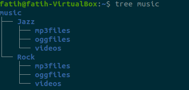

# NOTES 4 | MANAGING FILES AND DIRECTORIES
Commands are often followed by an option that modify/enhance them.
Commands are also followed by arguments.
For example : ls = **command** -l = **option** ~/Downloads = **argument**
ls -l ~/Downloads 

## Creating Directories
The **mkdir** command is used for creating directories.

**Usage** :
mkdir + the name of the directory 
and to create multiple directories a space between directories is required.
**Examples**
* mkdir photos (Creates a directory in working directory)
* mkdir hd nature (Creates multiple directories in the working directory)
* mkdir -p photos/hd/nature(Directory with a parent directory)

## Creating Files
The **touch** is used to create files.

**Usage and Examples** :
* touch file1(Creates a file called file1)
* touch file1 file2 file3(TO create multiple files)
* touch "a file with a space" (To create a file that has spaces in the name)
  
## Deleting Files and Directories
The **rm** command is used to remove files.

To remove non empty directories we must use **rm -r**.
To remove empty directories **rmdir** command is useful.
**Usage and Examples**:
* rm file1 (Removes the file1)
* rmdir directory1(Removes the empty directory)
* rm -r Photos/Hd (Removes the non-empty directory)

## Moving files and directories
The **mv** command is to move and rename directories.

**Examples and usage** 
* mv file1 ~/Downloads (To move file1 from current directory to Downloads)
* mv file1 newfile1(To rename file1 to newfile1)
* mv Downloads/bird.jpg Photos/newbird.jpg(To move and rename it)

## Copying Files and Directories
The **cp** command is to copy files/directories to another destination.
It has the same usage as the mv command.

**Examples and usage**
* cp file1 ~/Photos(To copy a file to another destination)
* cp -r directory1 ~/Downloads(To copy a directory to a destination)
* sudo cp -r file1 file2 ~/Documents(To copy multiple files in a single command)

## Working with links
* Inode is a data structure that contains all the information about a file except its name and content.
* Every file in the file system has an inode.
* Each inode is identified by an inode number.(Index Number)
* To view a file's inode number we use ls -i command.
* To display the inode data on a file or directory we use the command stat + file 
### HARD LINKS AND SOFT LINKS
**HARD LINK EXPLANATION WITH GRAPH**
 
**SOFT LINK EXPLANATION WITH GRAPH**

## GETTING HELP
**Man(manual)** pages are documentation files that describe Linux shell. They are quick references to help. 
To navigate the man page of a command, you can use the arrow keys.
**EXAMPLES AND USAGE**:
* man ls
* man cp
**--HELP** is also very useful and can show the solution most of the time.

## WILDCARDS/ FILE GLOBBING
* Wildcard represents letter and characters used to specify a filename for searches.
* File globbing is the processing of pattern matching using wildcards.
### THE * WILDCARD
The main wildcard is a star, is asterisk.
We use it to list files with extensions.
To autocomplete a filename if we do not remember the full name of the file.
**USAGE AND EXAMPLES**
* ls *.txt (This will list the files with the extension txt)
* ls file.*(This will list files that start with the string file regardless of the extension they have)
* ls *.txt *.pdf (This will use to list multiple files with extensions)
### THE ? WILDCARD
The ? wildcard matches precisely one character. This wildcard is very useful when used with hidden files which are also called **dot files** 
**USAGE AND EXAMPLES**
* ls .??* (This will list all hidden files because hidden files start with a dot and star wildcard will help ignore the rest of the file's name)
* ls *.???(This will list all files with 3 letter file extension)
* ls ../.??*(This will go back to the parent directory and list all the dot files)
### THE [] WILDCARD
The brackets wildcard match a single character in a range.
The brackets wildcard use the exclamation mark to reverse the match.
**USAGE AND EXAMPLES**
* ls f[aeiou]*(This will match all files that have a vowel after letter f)
* ls f[a-z](This will match all files that have a range of letters after f)
* ls *[!0-9]\* (This will match all the files whose hame does have a number in their file name) 
## USING BRACE EXPANSION
The brace expansion os a feature of bash that allows to generate arbitrary strings to use .
**USAGE AND EXAMPLES**
* mkdir -p food/{fried,baked}(This will create a parent directory with 2 subdirectory in a single command using brace expansion)
* touch file{1,2,3,4,5}(This will create 5 files named file1,file2 and etc.)
* mkdir -p music/{Rock/{mp3files,videos,oggfiles},Jazz/{mp3files,videos,oggfiles}} (we can create a file structure in single command like this)

