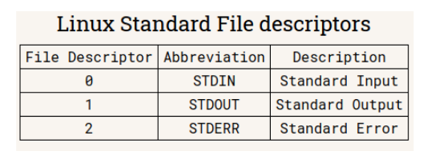

# NOTES 5 | Handling TEXT FILES
Linux offers a lot of command line tools for handling text. Those are ;

## CAT 
**cat** is used for displaying the content of a file.
**Examples and usage**
* cat + file to display 
Example: 
* cat file1
* cat -n file1 (to display the content of a file with line numbers)
* cat -E file1 (to display $ at the end of every line)

## TAC
**Tac** command is used for displaying the content in reverse order.
**Examples and usage**
* tac + file to display 
* tac + file1 + fil2

## MORE 
The **more** command is a pager program used for displaying a text file only one page at a time.
**Examples and usage**
* p more + file to view
* p more -20 file2 (open the file 10 lines at a time)
 
## LESS
The **less** command is another pager program like more and displays the content one page at a time.
**Examples and usage**
* less + file to view
* less -N file1(open a file with line numbers)

## HEAD
The **head** command displays the top N number of lines of a given file. By default it is set to show only first 10 lines of code.
**Examples and usage**
* head + option + file
* head file1(to show the first 10 lines of a file)
* head -6 file1(displays the first 5 lines of a file)

## DIFF
The **diff** command compares files and displays the differences between them.
**Examples and usage**
* diff + option + file1 + file2 
* diff file1 file2 (to show the differences they have)
* diff -y file1 file2(display the difference between two files in a column format.)

## TAIL 
The **tail** command displays the last N number of lines of a given file. By default it is set to 10 lines.
**Examples and usage**
* tail + option + file
* tail file1 (displays the last 10 lines of a file)

## CUT
The **cut** command is used to extract a specific section of each line and display it .
**Examples and usage**
* cut + option + file
* cut f1 file1.txt (displays the first field of each line using tab as the field operator)
* cut -d -f1 file1.txt (displays the first field of each line, using : as the field operator)

## PASTE
The **paste** command is used to join files horizontally in columns.
**Examples and usage**
* paste + option + file1 + file 2
* paste file1.txt file2.txt
* paste -s file1.txt file2.txt (merge files sequentially instead of horizontally.)

## SORT
The **sort** command is used for sorting files. Sorting means arranging the content of the file in a particular order.The sort command supports sorting alphabetically, in reverse, by number and month.
**Examples and usage**
* sort file1.txt
* sort -o file1.txt file1.txt(sort the file and save the output to a new file.)
* sort -r file1.txt(sort the file in reverse order.)

## WC
The **wc** command is used for printing the number of lines, characters and bytes in a file
**Examples and usage**
* wc + option + file1
* wc -c file1.txt(display the numbers of bytes in a file.)
* wc -l file1.txt(display the number of lines in a file)

## TR
The **tr** command is used for translating or deleting characters from standard output.
**Examples and usage**
* standard output | tr + option + set + set
* cat file1.txt | tr '.' ',' file2.txt(translate one character to another , in this case a period with a comma)
* cat program.py | tr "[:space:]" '\t'(translate white space into tabs.)

## GREP
The grep command is used to search a string in a file or standard output when using a pipe
**Examples and usage**
* grep + option + pattern to match + file
* grep "ip" file1.txt (to search for "ip" in the file)
* grep -i "ip" file5.txt (to search for a string in a file with case insensitivity.)

## Rev
Rev command is used for reversing characters position in a given text and is not commonly used. 
**Examples and usage**
* rev + file1
* rev file1.txt (reverse the content of a file.)

## I/O Redirection
In linux , inputs and output can be redirected as well as connecting multiple commands together.
File descriptors are positive integers used for identifying open files in a given session. 

**Examples and usage**
* To redirect standard output > is used and to append >> is used
* ls -l > file1.txt , ls -l >> file1.txt
* To redirect standard error 2> is used
* cat file2.txt 2> errorfile2.txt

## The pipe | 
The pipe allows you to redirect the standard output of a command to the standard input of another.
**Examples and usage**
* command1 + | + command 2 | + command #
* man ls | grep "^[[:space:]]*[[:punct:]]"

## Alias 
-A shorthand for a more complicated command.
alias name of alias = "command here"
**Examples and usage**
* alias add = "git add . "
* alias push = "git push"