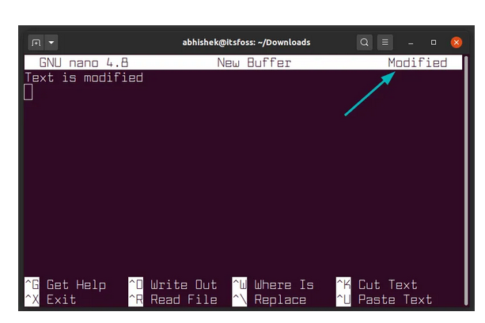
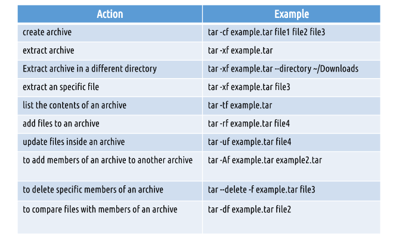
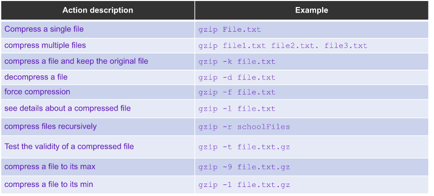
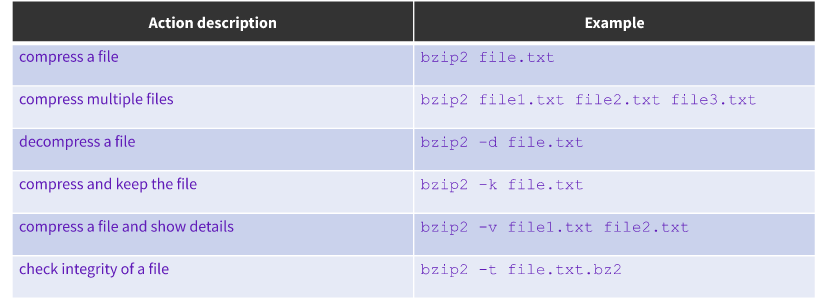
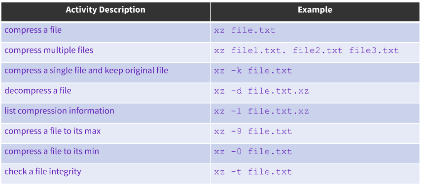
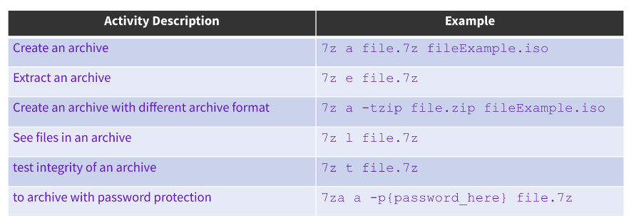
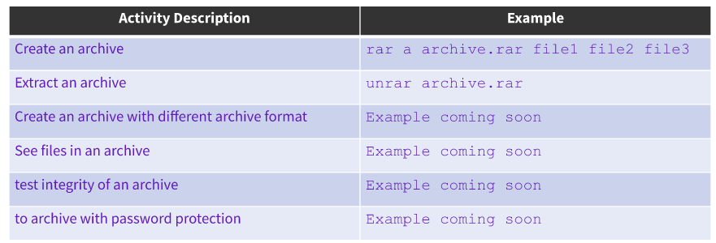
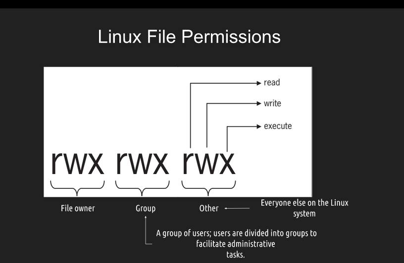
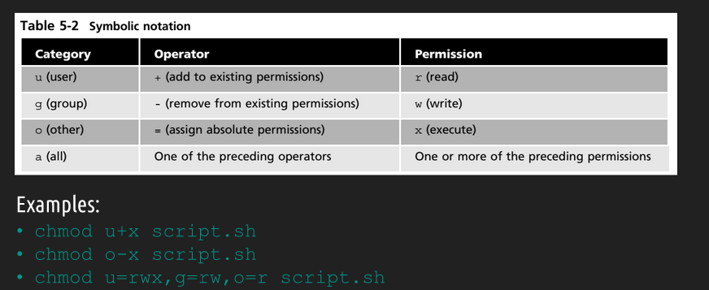
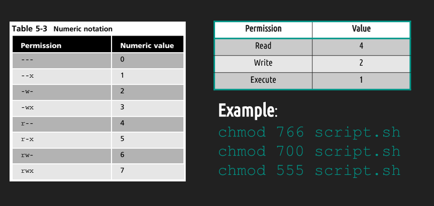

# Notes Lecture 06 | Managing Data and File permissions
## Text Editors 
**NANO AND VIM**
The **vi** command-line text editor is included in all POSIX compliant operating systems.
Learning vi is easy but mastering is difficult which is necessary for system administration.
Vi has evolved into many different forms, including vim, which stands for "vi improved".
To install vim 
**sudo apt install vim**
**Examples and Usage**
To start vim type vim.
* : -> for entering command line
* q -> short for quit
* a -> short for all buffers
* ! -> force
* :qa! -> quit all now
* H = left
* J = down
* K = up
* L = right
* use / and the word you are looking for to search forward.
* /hello
* To search backwards
* ?hello

**Nano** is bundled with many popular Linux distros, and you can launch it by running the nano command. All actions in nano are initiated with keyboard shortcuts, and you can see the most important ones at the bottom of the screen.
To create a newfile:
nano file1.txt
Nano options and shortcuts

## Managing Data
Backup: Copies files and directories to an archive
System Backup : Use to restore data in case of a system failure or data loss or corruption.
Archive: File containing many other files, each of which is still identified by filename, owner , permissions and timestamp.

**Archiving Utilities**
**Tar**: creates archives by combining files and directories into a single file.
*Examples and usage*

**CPIO**: Creates an archive, restores files or copies a directory.
*Examples and usage*
Cpio requires a list of files to archive. To create archive -o
* ls | cpio -ov > archive.cpio
* To extract an archive to cpio use the -i option with <
* cpio -iv < archive.cpio
* To create a tar archive with cpio
* ls | cpio -ov -H tar -F example.tar

**Ar**:creates, modifies and extracts from archives.
The ar program creates modifies and extracts from archives.
*Examples and usage*
* ar r test.a *.txt(archive files with ar)
* ar t test.a (to list contents of an archive)

**File Compression**
Originally, Unix file compression was handled by a utility called 'compress'.
The **gzip**, **bzip2**, and **xz** commands are used for compression. 
* When we compress a file with any of these tools the result is a file with similar name but with different file extension dependant on the tool used.
For example:
file.txt --->> file.txt.gz
file.txt --->> file.txt.bz2
file.txt --->> file.txt.xz

**Gzip Usage** 

**bzip2 usage**

**xz usage**

***File compression with zip,7zip and rar***
**Zip** is an  archiving and compression utility.
**7-zip** is open source file archiver with a high compression ratio.
**Rar** allows linux user to extract or create rar archives.

## Linux File Permissions | File Ownership.
* A file can be owned only by one user and one group. 
* ls -l shows you the file user owner and group owner.

**chown** command is used for changing group owner.
Example and usage:
* chown file.txt

File permissions 

Files vs Directories 
**Read** gives users to read the file or open the directory
**Write** gives users permission to read and edit its content and for directories to view and add or remove subdirectories
**Execute** allows users to run the file (allows users to run the file) and for directories switching directories with cd command.

Examples and Usage
**SYMBOLIC NOTATION**

**NUMERIC NOTATION**
